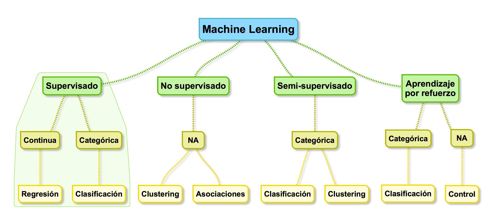
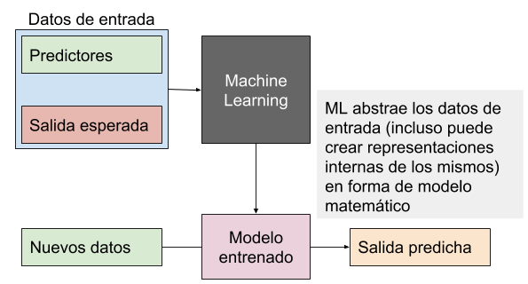
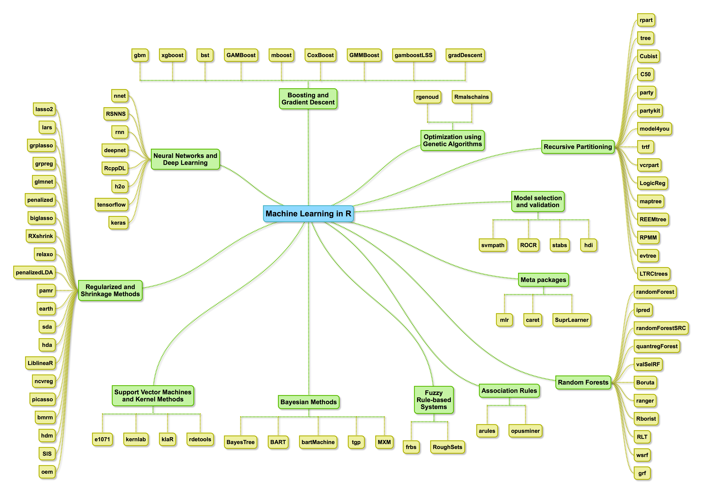
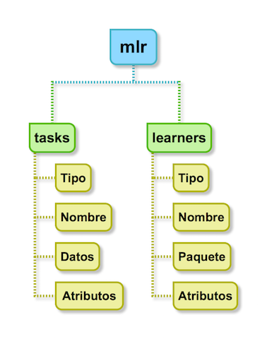

```{r xaringan-themer, include=FALSE}
library(xaringanthemer)
solarized_light(
  background_color = "#ffffff",
  text_color = "#000000",
  code_font_size = "0.9em",
  code_font_family = "Fira Code",
  code_font_url    = "https://cdn.rawgit.com/tonsky/FiraCode/1.204/distr/fira_code.css",
  extra_css = list(".small" = list("font-size" = "90%"),
                   ".tiny" = list("font-size" = "80%"))
)
```

```{r setup, include=FALSE}
knitr::opts_chunk$set(fig.height = 5.1, 
                      fig.width = 5.1,
                      fig.align = "center")
options(htmltools.dir.version = FALSE)
library(tidyverse)

many_models <- readRDS(file = "./many_models.rds")
caret_models <- readRDS(file = "./caret_models.rds")
my_learners <- readRDS(file = "./my_learners.rds")
caret_results <- readRDS(file = "./caret_results.rds")
results_ad <- readRDS(file = "./results_ad2.rds")
caret_class_results <- readRDS(file = "./caret_class_results2.rds")

```

class: center, middle

# Machine Learning

.pull-left[

]

.pull-right[

<br/>

### Una máquina _aprende_ si es capaz de utilizar experiencias pasadas para mejorar su desempeño futuro en una tarea
]

---
class: center, middle
# Tipos de machine learning



---
class: center, middle

# El proceso

### 


---
class: center, middle
# Paquetes de R para Machine Learning



---

# Paquetes de R que vamos a usar

- [mlbench](https://cran.r-project.org/package=mlbench)

Una colección de problemas de prueba, tanto artificiales como reales, que incluyen, por ejemplo, algunos de los datasets del repositorio UCI.

- [mlr](https://github.com/mlr-org/mlr)

Machine Learning en R 


- [caret](https://github.com/topepo/caret/)

Diversas funciones para entrenar modelos y para representar gráficamente modelos regresión y clasificación.

- Y la distribución _base_!

Los instalamos antes de empezar:
```{r eval = FALSE}
install.packages(c("mlbench", "mlr", "caret"))
```

---
class: inverse, center, middle
# Regresión

### 


---

# Datos

Cargamos los datos:
```{r}
library(mlbench)
data("BostonHousing")

```
```{r, echo = FALSE, eval = TRUE}
head(BostonHousing) %>% 
  knitr::kable(format = "html") %>% 
  kableExtra::kable_styling(font_size = 12)
```

Datos sobre el precio de la vivienda en los suburbios de Boston, expresados en miles de dólares,
con variables numéricas que indican aspectos del vecindario, de la criminalidad, etc.

El objetivo es predecir dicho precio de la vivienda a partir del resto de parámetros proporcionados.

---

# `R` - Base

Construimos el modelo:

```{r}
base_model <- lm(medv ~ ., data = BostonHousing)
```

```{r echo = FALSE, eval = TRUE}
summary(base_model) %>%  .[["coefficients"]] %>% 
  knitr::kable(format = "html") %>% 
  kableExtra::kable_styling(font_size = 12)

```

---

# Evaluación del desempeño

La regresión lineal tiene $R^2=$ `r round(summary(base_model)$adj.r.squared, 2)`.

Evaluamos su desempeño:
```{r}
predictions <- base_model %>% predict(newdata = BostonHousing)

target_var <- BostonHousing$medv

mse_base <- mean((predictions - target_var) ^ 2)

```

El error cuadrático medio (MSE) obtenido por el modelo lineal es `r round(mse_base, 2)`.

---
class: center, middle

# El paquete .small[`mlr`]

### 

---

# .small[`mlr`] - Tasks

```{r results='hide', message=FALSE}
library(mlr)
boston_task <- makeRegrTask(data = BostonHousing, 
                            target = "medv")
```

```{r echo = FALSE, comment=""}
boston_task
```

---

# .small[`mlr`] - Learners

Lista de métodos (_learners_) que son capaces de hacer regresión:

```{r warning=FALSE, message=FALSE}
regr_learners <- listLearners() %>% subset(type == "regr")
```

```{r, echo = FALSE, eval = TRUE}
regr_learners %>%
  dplyr::select(class, name, package, type, installed, numerics, factors) %>% 
  head() %>% 
  knitr::kable(format = "html", escape = FALSE) %>% 
  kableExtra::kable_styling(font_size = 8)
```

Sólo aquellos que están instalados:
```{r, echo = FALSE, eval = TRUE}
regr_learners %>% subset(installed == TRUE) %>% head() %>% 
  dplyr::select(class, name, package, type, installed, numerics, factors) %>% 
  knitr::kable(format = "html", escape = FALSE) %>% 
  kableExtra::kable_styling(font_size = 8)
```

---

# .small[`mlr`] - Entrenamiento

```{r results="hide"}
models <- benchmark(learners = "regr.lm", 
                    tasks = boston_task,
                    show.info = FALSE)
```

```{r echo = FALSE}
models$results$BostonHousing$regr.lm$measures.test %>% 
  knitr::kable(format = "html", escape = FALSE) %>% 
  kableExtra::kable_styling(font_size = 10)
```

El MSE final es: `r round(models$results$BostonHousing$regr.lm$aggr, 2)`. (El encontrado usando `lm` directamente era `r round(mse_base, 2)`).

¿Por qué la diferencia con lo anterior? *Hemos hecho trampas*.

---
class: center, middle
# Validación cruzada

.pull-left[


_Human Learning_

]

.pull-left[

<br/>


<br/>

_Validación_

_Sobreentrenamiento_

]

---
# .small[`mlr`] - Comparación entre métodos:
```{r results='hide', eval = FALSE}
my_learners <- regr_learners %>% 
  subset(factors == TRUE & installed == TRUE)

many_models <- benchmark(learners = my_learners$class, 
                         tasks = boston_task)
```

```{r echo = FALSE, eval = TRUE}
v <- sapply(many_models$results$BostonHousing, function(i) i[["aggr"]])
names(v) <- my_learners$name

v <- v %>% 
  as.data.frame()

colnames(v) <- c("MSE")

v %>% 
  knitr::kable(format = "html") %>% 
  kableExtra::kable_styling(font_size = 10)
```

---
# .small[``mlr] - Visualización de resultados

```{r fig.align="center"}
plotBMRBoxplots(many_models, style = "violin")
```

---
# El paquete .small[`caret`]

```{r message=FALSE, warning=FALSE, results="hide"}
library(caret)
modelLookup()
```

```{r remedy001, echo = FALSE, eval = FALSE}

caret_models <- data.frame(
  class = caret_models_info %>% names(),
  name = caret_models_info %>% sapply(function(i) i[["label"]]) %>% unlist(),
  package = caret_models_info %>% sapply(function(i) paste0(i[["library"]], collapse = ",")),
  installed = caret_models_info %>% sapply(function(i) all(i[["library"]] %in% available.packages())),
  regression = caret_models_info %>% sapply(function(i) "Regression" %in% i[["type"]]),
  classification = caret_models_info %>% sapply(function(i) "Classification" %in% i[["type"]]),
  stringsAsFactors = FALSE
)
```

```{r echo = FALSE}
caret_models %>% 
  head(n = 15) %>% 
  knitr::kable(format = "html", row.names = FALSE) %>% 
  kableExtra::kable_styling(font_size = 10)
```

---
# .small[`caret`] - Entrenamiento

Debemos especificar el método de validación que queremos usar, y usamos la función `train` para entrenar dicho método.

```{r}
fitControl <- trainControl(method = "repeatedcv",
                           number = 10,
                           repeats = 10)

caret_lm_model <- train(medv ~ ., 
                        data = BostonHousing, 
                        method = "lm",
                        trControl = fitControl)
```

---
# .small[`caret`] - Resultado

El resultado de entrenar el modelo de regresión lineal es:

.small[
```{r echo = FALSE, eval = TRUE, comment=""}
print(caret_lm_model)
```
]

Podemos observar que se ha conseguido un MSE = `r round(caret_lm_model$results$RMSE ^ 2, 2)`.

---
# .small[`caret`] - Comparación entre métodos

En `caret`, a diferencia de `mlr`, no existe un método para comparar todos los métodos que queremos, así que hay que ejecutar todos los métodos uno a uno:

```{r echo = FALSE}
regr_caret <- caret_models %>% 
  subset(regression == TRUE & installed == TRUE)

```

```{r echo = TRUE, eval = FALSE}

methods <- c("cubist", "gbm", "xgbTree")

methods %>% 
  lapply(function(x) {
    
    train(medv ~ ., 
          data = BostonHousing,
          method = x,
          trControl = fitControl,
          verbose = FALSE)
    
  }) -> caret_results
```

*Hemos tenido que utilizar un `lapply` para ejecutar todos los métodos que nos interesaban.*

---
# .small[`caret`] - Resultados

```{r eval=TRUE, echo=FALSE, comment="", size=8}
methods <- c("cubist", "gbm", "xgbTree")
names(caret_results) <- methods

print(caret_results$cubist)
```

---
# .small[`caret`] - .small[`tuneGrid`]

- Los métodos tienen usualmente un número de _hiperparámetros_ que ajustar.
- Por defecto, `caret` se encarga de estudiar una serie de configuraciones para cada método que utiliza en el entrenamiento.
- Si el método que queremos entrenar tiene $p$ posibles hiperparámetros que configurar, `caret` usa de entrada $3^p$ configuraciones.
- Podemos especificar otras configuraciones de prueba mediante el argumento `tuneGrid` de la función `train`.
.small[
```{r eval = FALSE, echo = TRUE}
train(x, y, method = "rf", preProcess = NULL, ...,
  weights = NULL, metric = ifelse(is.factor(y), "Accuracy", "RMSE"),
  maximize = ifelse(metric %in% c("RMSE", "logLoss", "MAE"), FALSE, TRUE),
  trControl = trainControl(), tuneGrid = NULL,
  tuneLength = ifelse(trControl$method == "none", 1, 3))
```
]

---
# .small[`caret`] - Hiperparámetros

```{r echo = TRUE, eval = FALSE}
getModelInfo(model = "xgbTree")[[1]]$parameters
```
```{r echo = FALSE, eval = TRUE, comment = ""}
getModelInfo(model = "xgbTree")[[1]]$parameters %>%  
  knitr::kable(format = "html") %>% 
  kableExtra::kable_styling(font_size = 14)

```

---
# .small[`caret`] - Resultados (II)
.tiny[
```{r eval=TRUE, echo=FALSE, comment="", size=8}

R <- testthat::capture_output_lines(print(caret_results$xgbTree), width = 100)

R <- c(head(R, 17), "  ...", tail(R, n = 7))

cat(R, sep = "\n")
```
]

---
# .small[`caret`] - Visualización de resultados

```{r fig.align="center", fig.height=6.5, fig.width=6.5}
plot(caret_results$xgbTree)
```

---
class: inverse, center, middle
# Clasificación

### 

---
# Datos

```{r}
AlzheimerData <- readRDS("./AlzheimerData2.rds")
```

Usaremos datos procedentes de análisis de imagen médica tanto a pacientes de Alzheimer como sujetos sanos. 

Tenemos unos 600 sujetos, de los cuales aproximadamente 330 son sanos.

Los datos incluyen valores demográficos y parámetros morfológicos del cerebro (volumen y grosor) de cada individuo, hasta llegar a unas 340 variables por sujeto.

El objetivo del problema es intentar _predecir_ el valor de la variable de clase (AD - _Alzheimer_ - o HEALTHY - _sano_ -) a partir del resto de variables.

```{r echo = FALSE, eval = TRUE}
AlzheimerData[, c(1:5)] %>% 
  head() %>% 
  knitr::kable(format = "html") %>% 
  kableExtra::kable_styling(font_size = 10)
```


---
# .small[`mlr`] - Definición del problema

Vamos ahora a crear una tarea de clasificación asociada a los datos que hemos importado, y seleccionamos qué métodos queremos/podemos usar:

```{r results='hide', message=FALSE, warning=FALSE}
ad_task <- makeClassifTask(id = "Alzheimer Disease", 
                           data = AlzheimerData, 
                           target = "CLASS")

my_class_learners <- listLearners() %>% 
  subset(type == "classif" & installed == TRUE & factors == TRUE)
```
.tiny[
```{r echo = FALSE, eval = TRUE, comment = ""}
ad_task
```
]
---
# .small[`mlr`] - Entrenamiento

Vamos a usar los métodos disponibles para clasificar los sujetos:

```{r eval = FALSE, echo = TRUE}
results_ad <- benchmark(learners = my_class_learners$class, 
                        tasks = ad_task, 
                        measures = list(mmce))
```

```{r eval = TRUE, echo = FALSE}
v <- sapply(results_ad$results$`Alzheimer Disease`, function(i)
  i$aggr[["mmce.test.mean"]]
)

best_classifier <- gsub(names(v)[which.min(v)], 
                        pattern = "classif.", 
                        replacement = "")

w <- v %>% 
  as.data.frame()

colnames(w) <- c("MMCE")

w %>% 
  knitr::kable(format = "html") %>% 
  kableExtra::kable_styling(font_size = 14)
```

El error mínimo obtenido ha sido de `r round(min(w)*100, 2)`% y lo ha obtenido `r best_classifier`.

---
# .small[`mlr`] - Visualización de resultados

```{r fig.align="center"}
plotBMRBoxplots(results_ad, mmce, style = "violin")
```

---
# .small[`mlr`] - Matriz de confusión

Otra forma de ver cómo se ha comportado el mejor modelo es a través de la matriz de confusión:

<br/>

```{r echo = FALSE, eval = TRUE}
w <- results_ad$results$`Alzheimer Disease`$classif.C50$pred$data
table(w$truth, w$response) %>% 
  knitr::kable(format = "html") %>% 
  kableExtra::kable_styling(font_size = 14)
```

<br/>

Este tipo de tablas nos proporciona información acerca de la sensibilidad (tasa de falsos negativos) y la especificidad (tasa de falsos positivos) del método.
---
# .small[`mlr`] - Predicción en nuevos sujetos

Tomamos algunos individuos de forma aleatoria:
.tiny[
```{r}
indices <- sample(nrow(AlzheimerData), size = 15)

test <- AlzheimerData[indices, ]
truth <- AlzheimerData[indices, "CLASS"]
```
]
Y predecimos la variable de respuesta `CLASS` para el mejor clasificador, sobre estos sujetos:
.tiny[
```{r}
library(C50)
predicted_y <- predictLearner(
  .learner = results_ad$learners[["classif.C50"]], 
  .model = results_ad$results$`Alzheimer Disease`[["classif.C50"]]$models[[1]], 
  .newdata = test
)
```
]

---
# .small[`mlr`] - Resultados sobre los nuevos sujetos

.pull-left[

```{r echo = FALSE, eval = TRUE}
data.frame(truth, predicted_y) %>% 
  knitr::kable(format = "html") %>% 
  kableExtra::kable_styling(font_size = 14)
```
]

.pull.right[

<br/>

```{r echo = FALSE, eval = TRUE}
table(truth, predicted_y) %>% 
  knitr::kable(format = "html") %>% 
  kableExtra::kable_styling(font_size = 14)
```
]
---
# .small[`caret`] - Entrenamiento

Igual que en el caso de la regresión, debemos especificar los métodos a entrenar de antemano, y entrenar cada uno por separado.

```{r echo = TRUE, eval = FALSE}
methods <- c("gbm", "nnet", "rpart", "regLogistic", "xgbTree")

methods %>% 
  lapply(function(x) {
    
    print(x)
    
    caret::train(CLASS ~ ., 
                 data = AlzheimerData2,
                 method = x,
                 trControl = fitControl)
    
  }) -> caret_class_results

names(caret_class_results) <- methods
```

---
# .small[`caret`] - Resultados (individual)

.tiny[
```{r comment = ""}
print(caret_class_results$gbm)
```
]
---
# .small[`caret`] - Resultados (comparativo)

Si comparamos los resultados obtenidos por todos los clasificadores, los resultados son como siguen:

```{r eval = TRUE, echo = FALSE, comment=""}
best_mmce <- 1 - sapply(caret_class_results, function(i) max(i$results$Accuracy, na.rm = TRUE))

best_classifier_caret <- names(best_mmce)[which.min(best_mmce)]

w <- best_mmce %>% as.data.frame()

colnames(w) <- "MMCE"

w %>% 
  knitr::kable(format = "html") %>% 
  kableExtra::kable_styling(font_size = 14)

```

En este caso, el mejor clasificador ha sido `r best_classifier_caret` con un error (MMCE) de `r round(best_mmce[best_classifier_caret] * 100, 2)`%.

---
# .small[`caret`] - Matriz de confusión

Vemos la matriz de confusión obtenida por el mejor método, usando todo el conjunto de datos:

```{r echo = FALSE, eval = TRUE}
predicted_y <- caret_class_results[[best_classifier_caret]] %>%  
  predict(newdata = AlzheimerData)

table(AlzheimerData[, "CLASS"], predicted_y) %>% 
  knitr::kable(format = "html") %>% 
  kableExtra::kable_styling(font_size = 14)

```


---
# .small[`caret`] - Predicción en nuevos sujetos

```{r remedy002, eval = TRUE, echo = TRUE}
predicted_y <- caret_class_results[[best_classifier_caret]] %>%  
  predict(newdata = test)
```

.pull-left[
.tiny[
```{r echo = FALSE, eval = TRUE}
data.frame(truth, predicted_y) %>% 
  knitr::kable(format = "html") %>% 
  kableExtra::kable_styling(font_size = 12)
```
]
]

.pull.right[

<br/>

```{r echo = FALSE, eval = TRUE}
table(truth, predicted_y) %>% 
  knitr::kable(format = "html") %>% 
  kableExtra::kable_styling(font_size = 14)
```
]

---
# Conclusiones

- Existe multitud de paquetes para aplicar métodos de Machine Learning dentro de R, con muy diversas especializaciones.

- Para alguien no experto, lo mejor es utilizar uno de los paquetes `caret` o `mlr`: Nos proporcionan _interfaces_ de alto nivel con los paquetes que implementan los diversos métodos.
- Para quien ya tenga experiencia, se puede empezar por comparar diversos métodos usando uno de los paquetes anteriores y, posteriormente, usar el paquete concreto del método que haya demostrado mejores resultados.

- `caret` facilita hacer búsqueda de la mejor configuración de un método, pero `mlr` es más útil a la hora de comparar varios métodos entre sí.
- Lo mismo se aplica a la visualización de los resultados: en `mlr` se pueden representar varios métodos a la vez y compararlos, mientras que en `caret` no es sencillo esto último, sin embargo se puede usar para comparar las distintas configuraciones testeadas.

---

class: inverse, center, middle

# ¡Gracias!

twitter: `@dominlopez` - `@_RMlg`

github: `neuroimaginador` - `RMalagaGroup`

.tiny[Slides created via the R package [**xaringan**](https://github.com/yihui/xaringan).]

