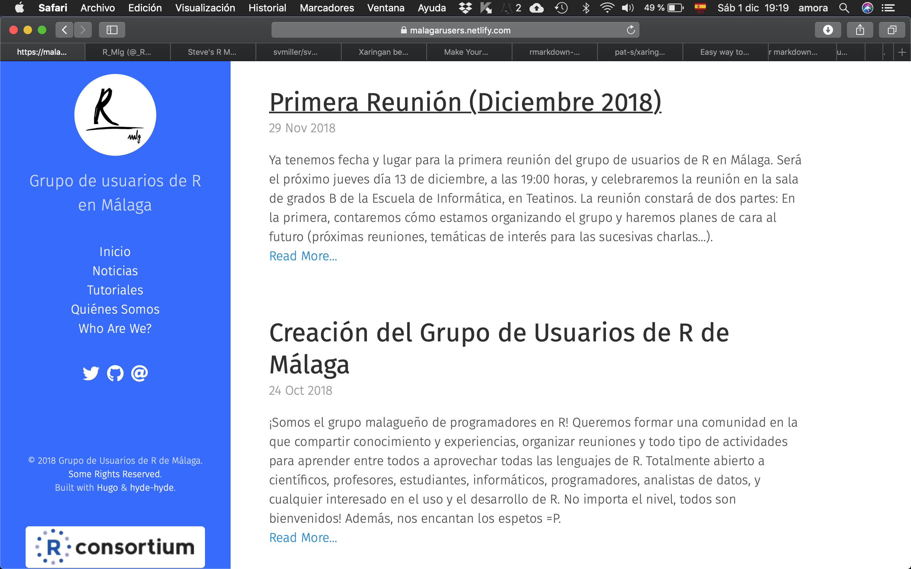
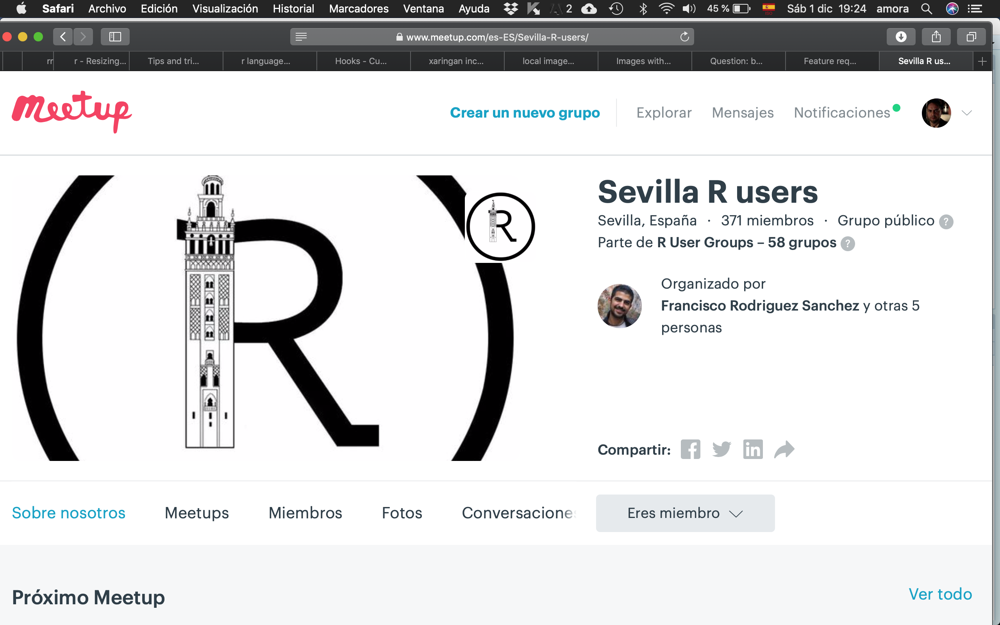
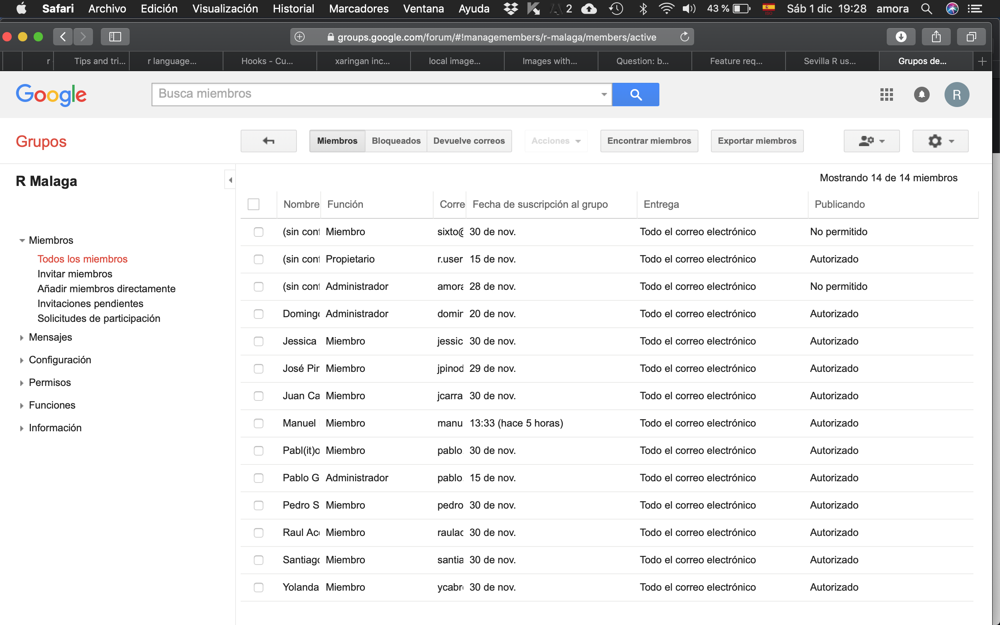
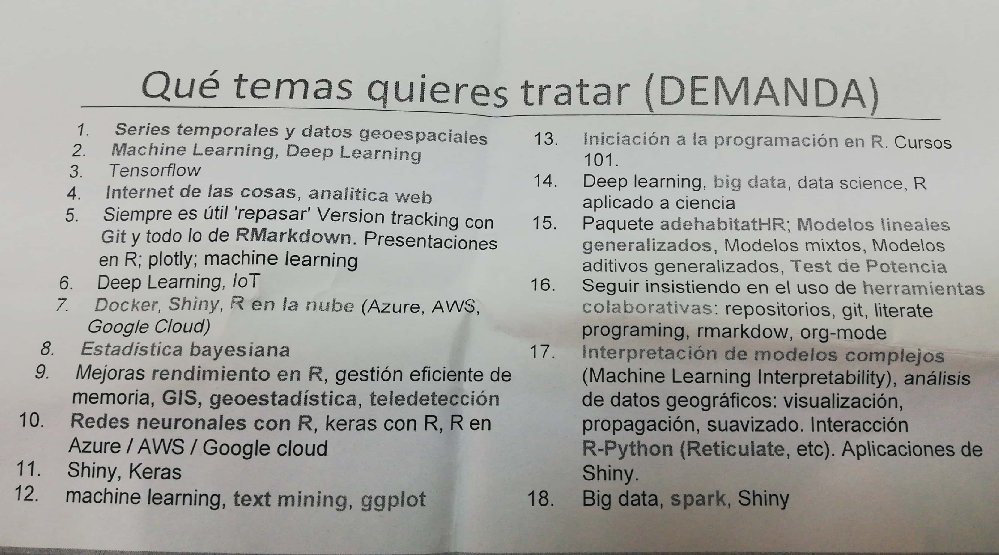
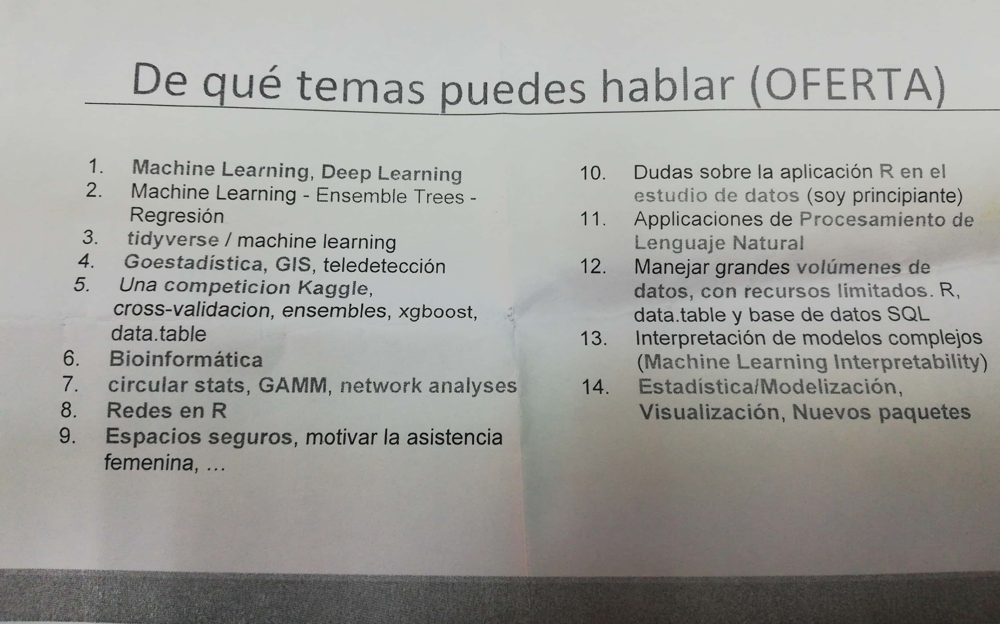

```{r setup, include=FALSE}
options(htmltools.dir.version = FALSE)
library(knitr)
```
     

---
background-image: url("fondo1.png")
background-size: cover

 

<!-- Image credit: [Wikimedia Commons](https://commons.wikimedia.org/wiki/File:Sharingan_triple.svg) -->

 


  <!-- background-image: url("photographer.jpg"); /* The image used */ -->
  <!-- background-color: #cccccc; /* Used if the image is unavailable */ -->
  <!-- height: 500px; /* You must set a specified height */ -->
  <!-- background-position: center; /* Center the image */ -->
  <!-- background-repeat: no-repeat; /* Do not repeat the image */ -->
  <!-- background-size: cover; /* Resize the background image to cover the entire  -->

# Objetivos del grupo https://malagarusers.netlify.com
- Grupo de Usuarios de R,
- formar *comunidad* en la que **compartir** conocimiento y experiencias, 
- organizar reuniones y todo tipo de actividades para aprender entre todos a aprovechar todas las lenguajes de R.

Grupo plural: usuarios de R en empresas, en universidad, en cualquier otra entidad.

Pueden formar parte del grupo:
- científicos, profesores, estudiantes, 
- informáticos, analistas de datos, 
- cualquier interesado en el uso y el desarrollo de R.
- **no importa el nivel, todos son bienvenidos** 
- **nos encantan los espetos**

---
<!-- class: inverse, left, middle -->
class: inverse, left

# ¿Qué tenemos?

---
# Twitter

- Usuario: **R_Mlg**

```{r, fig.width = 3, echo=FALSE}
# Bigger fig.width
knitr::include_graphics("twitter.png")
```
 
---
 
# Web

- [https://malagarusers.netlify.com](https://malagarusers.netlify.com)

```{r, fig.width = 3, echo=FALSE}
# Bigger fig.width

```
 
---
 
# Github

- [https://github.com/RMalagaGroup](https://github.com/RMalagaGroup)
- Ahora mismo la web del grupo usando **bookdown**
- Repositorio con material que el grupo deje.
- Podemos subir cualquier material que queráis **compartir**.

```{r, fig.width = 3, echo=FALSE}
# Bigger fig.width
knitr::include_graphics("gitub.png")
```
 
---

 
# R Consortium 

https://www.r-consortium.org/

**"The central mission of the R Consortium is to work with and provide support to the R Foundation and to the key organizations developing, maintaining, distributing and using R software through the identification, development and implementation of infrastructure projects."**

<https://www.r-consortium.org/projects/r-user-group-support-program>

- Petición de unión del grupo a R consortium el 09/11/18.
- Contestación: Fin de ayudas en 2018.
- Pendiente de solicitar en 2019.
- Ayuda: 150$, Meetup Pro.

---

# Meetup de Grupo de Usuarios de R de Sevilla

- [https://www.meetup.com/es-ES/Sevilla-R-users](https://www.meetup.com/es-ES/Sevilla-R-users/)
- Informar de grupo de Sevilla 

```{r, fig.width = 3, echo=FALSE}
# Bigger fig.width

```
 
---
 

#  Grupo de Usuarios de R de Málaga - en Google

- Miembros 
- Objetivos: plantear reuniones, consultas, etc.
- Es posible cambiar la configuración: cómo recibir la información del grupo,...
- Formularios de consulta, planning de nuevas reuniones,...

```{r, fig.width = 1, echo=FALSE}
# Bigger fig.width

```
 
---
class: inverse, left

# R Hispano

- <http://r-es.org/>
- <https://twitter.com/r_hisp>
- Grupo de google de los socios de R Hispano que se usa como foro de debate.
- Alojamiento a web (si hiciera falta).
- Promoción del grupo.
- Soporte legal a los grupos locales.


---
# Socio en R Hispano
Para ser socio de la comunidad de R-Hispano son necesarios los siguientes datos (mandar a correo de secretaría de RHispano).

- Nombre:
- Apellidos:
- Dirección de correo electrónico:
- Documento Nacional de Identidad:
- Nacionalidad (opcional):
- Dirección postal (opcional):
- Teléfono (opcional):


 
Tanto la cuota de Inscripción como la cuota anual son gratuitas. El objetivo de la Comunidad es fomentar el avance del conocimiento y uso del lenguaje de programación en R y el desarrollo de la profesión en todas sus vertientes, especialmente la investigadora, docente y empresarial.

---

# Grupos Locales 

<http://r-es.org/grupos-locales/>


- <https://www.meetup.com/es-ES/Grupo-de-Usuarios-de-R-de-Madrid/>
- <http://madrid.r-es.org>
- <https://www.meetup.com/es-ES/Sevilla-R-users/>
- <https://sevillarusers.wordpress.com>

- Barcelona (blog, meetup)
- Madrid (blog, meetup)
- Sevilla (blog)
- Almería (blog)
- Valencia (blog, meetup)
- Galicia (portal)
- Salamanca (portal)
- Murcia (portal)

---
# Jornadas de Usuarios de R

- Reunión anual
    - charlas
    - talleres
    - conferencias
- Inscripciones son muy baratas (gratis en algún caso)
- Próxima en Madrid
- ¿Siguiente?
- **Muy recomendables**
---
class: inverse, left

# Grupo de Usuarios de R de Málaga
---

# Reuniones, Planning, Difusión del grupo y de las actividades

- Una reunión al mes (aproximadamente)
  - una charla divulgativa
  - explicación de un paquete
  - una charla divulgativa + explicación de un paquete
  - una charla formativa (aprendizaje de R)
  - ...
- 1 Hackatton anual 
 
Hacer un informe de cada reunión incluidas las primeras e irlas subiendo a la web, Meetup, etc.  Creemos que para R consortium es importante. En Meetup se almacenan los asistentes a cada reunión.

- Usar twitter para difundir actividades, reuniones, etc.
- Sería interesante contactar con empresas.
- Grabar reuniones, streaming, Youtube,... 

---
# Reuniones, Planning, Difusión del grupo y de las actividades

Cuestiones (a debatir tras la charla de Domingo):

- Siguiente reunión 17/01. Confirmar.  
- Lugar de reuniones: 
    - Salas de Grados de E.T.S.I. Informática,
    - Laboratorio 1.1.10 de Matemática Aplicada (55 personas)
    - Cualquier otro.
    - ¿Y si hubiera más afluencia en otras?
    
- **Cerveza/s posterior/es, en Teatinos. Pensar en el sitio para hoy y para siguientes. Publicitar este tema. IMPORTANTE.**

---

# Información cedida por Grupo de Usuarios de R de Sevilla

Hicieron encuestas para ver demanda de temas y personas que estarían dispuestas a dar charlas.
---

 
---
 
